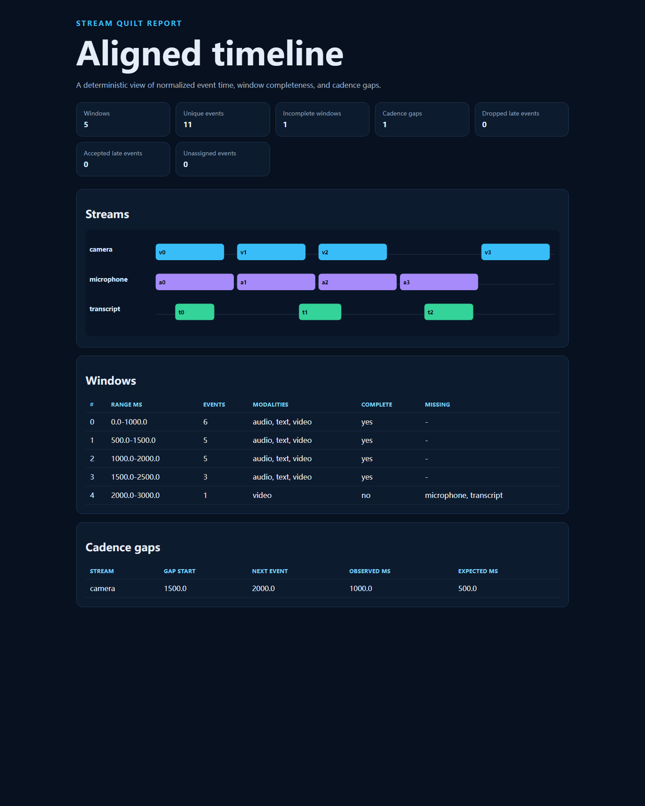

# Stream Quilt

Durable file replay now supports atomic source offsets, state and emitted windows
in SQLite. See [recovery and restart](docs/recovery.md) for the `resume` CLI and API.
The [local dataflow API](docs/dataflow.md) also runs composable map/filter/flat-map
operators and isolated keyed state with atomic per-input rollback and portable
checkpoints. Its generalized flow checkpoints are separate from aligner recovery.
Use [FlowJournal](docs/flow-journal.md) to atomically persist a linear flow's
source position, keyed state and local output records across process restarts.
The separate [branching dataflow API](docs/branching-dataflows.md) runs bounded
DAGs with conditional routes, edge-ordered merges and atomic state/output
publication across siblings. [GraphJournal](docs/graph-journal.md) persists the
graph's source position, all keyed state and terminal output provenance in one
SQLite CAS transaction. Run `python examples/durable_branching_totals.py` for
offline restart/replay; no automatic retry or external exactly-once claim.
Keyed [`stateful_flat_map`](docs/stateful-expansion.md) callbacks can atomically
replace or delete state and emit zero-to-many ordered values in either runtime,
including durable linear and graph journal recovery.

**Deterministic event-time alignment for video, audio, text, sensor, and custom streams.**

[](https://github.com/appleweiping/stream-quilt/actions/workflows/ci.yml)
[](https://github.com/appleweiping/stream-quilt/actions/workflows/codeql.yml)
[](https://www.python.org/)
[](LICENSE)

Multimodal evidence rarely arrives in order or on one clock. A camera frame may lead its nominal
timestamp, an audio chunk may arrive late, and a transcript segment may span more than one analysis
window. Stream Quilt makes those choices explicit: clock offsets, half-open windows, required streams,
watermarks, lateness, and cadence gaps are all configuration rather than hidden behavior.

It supports two complementary workflows:

- `align`: deterministic offline alignment independent of input order;
- `replay`: preserve arrival order and close windows through required-stream watermarks.

## Demo

```text
$ stream-quilt demo --output examples/demo-output --write-input
aligned 11 events into 5 windows (1 incomplete, 1 gaps, 0 dropped, 0 accepted late, 0 unassigned)
  alignment    examples/demo-output/alignment.json
  report       examples/demo-output/timeline.html
  config       examples/demo-output/config.json
  events       examples/demo-output/events.jsonl
```

The checked-in image below is a screenshot of the actual generated
[standalone report](examples/demo-output/timeline.html), not a design mockup.



## Features

- Strict JSON configuration and newline-delimited event input.
- Arbitrary stream and modality names while preserving opaque event metadata.
- Per-stream constant clock offsets.
- Robust median offset estimation from matched clock anchors.
- Robust affine clock-drift estimation and opt-in per-stream offset-plus-rate correction.
- Fixed and overlapping half-open windows.
- Long events included in every overlapping window.
- Required-stream completeness and missing-stream diagnostics.
- Deterministic offline sorting.
- Incremental event-time watermarks with bounded lateness.
- Explicit reject, drop, or accept-partial-without-reopening late policy.
- Explicit diagnostics for events that fall into gaps between non-overlapping windows.
- Per-stream cadence-gap diagnostics.
- Grid-aligned interval index for window membership instead of a buffer scan.
- Explicit watermark-bounded retention for the identity state of a long-running aligner.
- Resource guards for events per window and total output windows.
- Stable JSON and dependency-free HTML output.
- Standard-library runtime with no network, model, or media dependency.
- CloudEvents 1.0 structured JSONL ingestion with explicit alignment extensions.
- Reproducible offline-versus-watermark benchmark JSON with semantic output digests.
- Deterministic cross-stream joins over normalized event starts, with inclusive
  tolerances, overlapping-window provenance, and a bounded comparison budget.
- Incremental local dataflow over isolated JSON values: mapping, filtering,
  bounded expansion, exact keys and reusable per-step/per-key state.
- Copy-on-write state transactions, pull-based source consumption and strictly
  validated portable state snapshots with explicit semantic revisions.
- Bounded local DAG fanout, strict conditional branching and deterministic merge,
  with whole-graph work limits and one internal transaction across all siblings.

## Installation

Stream Quilt requires Python 3.11 or newer.

```bash
git clone https://github.com/appleweiping/stream-quilt.git
cd stream-quilt
python -m venv .venv
# Linux/macOS: source .venv/bin/activate
# Windows: .venv\Scripts\activate
python -m pip install -e .
```

Install development tools with `python -m pip install -e ".[dev]"`.

## Quick start

Validate input without producing output:

```bash
stream-quilt validate examples/demo-output/config.json examples/demo-output/events.jsonl
```

Align a finite dataset regardless of file order:

```bash
stream-quilt align examples/demo-output/config.json examples/demo-output/events.jsonl --output aligned
```

Exercise live arrival semantics:

```bash
stream-quilt replay examples/demo-output/config.json examples/demo-output/events.jsonl --output replayed
```

Ingest structured CloudEvents or run the versioned CPU benchmark protocol:

```bash
stream-quilt align examples/cloudevents-config.json examples/cloudevents.jsonl \
  --input-format cloudevents --output aligned
stream-quilt benchmark --events 3000 --streams 3 --repeats 7 --output benchmark.json
```

Pair camera and microphone events after alignment:

```bash
stream-quilt join examples/demo-output/config.json examples/demo-output/events.jsonl \
  camera microphone --max-delta-ms 40 --output joined.json
```

`join_streams()` deduplicates events that appear in multiple overlapping
windows, matches normalized start timestamps within the inclusive tolerance,
and records the shared window indexes for every pair. An omitted tolerance
returns all cross-stream pairs. The comparison budget is explicit, so a large
cartesian join fails closed instead of consuming unbounded memory or CPU.

See [CloudEvents integration and benchmark protocol](docs/cloudevents-and-benchmarks.md) for the exact
mapping, semantic comparison, reporting rules, and limits of the current evidence.

See [input-format.md](docs/input-format.md) for every field and validation rule.

## Python API

```python
from stream_quilt import align_events, load_config, load_events
from stream_quilt.report import write_report_bundle

config = load_config("examples/demo-output/config.json")
events = load_events("examples/demo-output/events.jsonl")
result = align_events(events, config)

for window in result.windows:
    print(window.start_ms, window.end_ms, window.complete, len(window.events))

write_report_bundle(result, config, "aligned")
```

Public models are defensively immutable: constructors snapshot caller-owned mappings and sequences,
nested event JSON is exposed through read-only mappings and tuples, and direct construction plus
`dataclasses.replace()` re-run domain validation. Every `to_dict()` method returns a detached,
ordinary JSON-ready object.

For live arrival order:

```python
from stream_quilt import WatermarkAligner

aligner = WatermarkAligner(config)
for event in events:
    for closed_window in aligner.ingest(event):
        publish(closed_window)
for final_window in aligner.flush():
    publish(final_window)
```

`flush()` is deterministic and idempotent. Ingestion after flush is rejected.

A long-running aligner also needs a retention policy, or its per-event identity records grow without
bound:

```python
from stream_quilt import RetentionPolicy, WatermarkAligner

aligner = WatermarkAligner(config, retention=RetentionPolicy(horizon_ms=60_000))
print(aligner.retained_event_count, aligner.released_event_count)
```

Identity records are released once the watermark has moved `horizon_ms` past the point where no
future window can reach them, so reported IDs and window contents are unchanged. `horizon_ms` must be
at least `window_ms`; a shorter horizon is refused rather than allowed to release an event that a
still-open window could include. `max_tracked_events` caps the retained records and raises when it is
reached, because bounded memory cannot hold an unbounded list of reported IDs.

### Sessions, partitions, and recovery

Sparse streams can be grouped into stream-local sessions, while a running aligner
can be partitioned and checkpointed for worker recovery:

```python
from stream_quilt import WatermarkAligner, partition_events, sessionize

sessions = sessionize(events, gap_ms=250)
partitions = partition_events(events, partition_count=4)
aligner = WatermarkAligner(config)
for event in events:
    aligner.ingest(event)
snapshot = aligner.checkpoint()
restored = WatermarkAligner.from_checkpoint(config, snapshot)
```

Session gaps are measured from the previous event's exclusive end. Partition IDs use
SHA-256 rather than Python's process-randomized `hash()`. Checkpoint restore verifies
the complete configuration digest and fails closed on a mismatch.

## Clock offsets and drift

Offsets are added to observed event timestamps. Estimate a constant offset from matched anchors:

```python
from stream_quilt import estimate_offset

estimate = estimate_offset([(1_000, 972), (2_000, 1_971), (3_000, 2_500)])
print(estimate.offset_ms, estimate.max_residual_ms)
```

The median resists a single outlier, while residuals reveal whether a constant offset is credible.

A constant cannot correct a clock that runs fast or slow. The error it leaves grows without bound
over a long capture, and multi-device captures routinely skew by tens to hundreds of ppm. Fit an
offset *and* a rate instead:

```python
from stream_quilt import AlignmentConfig, estimate_drift

fit = estimate_drift([(t * 1.0003, t) for t in (0, 750_000, 1_500_000, 2_250_000, 3_000_000)])
print(fit.rate_ppm, fit.offset_ms, fit.anchors_used, fit.pairs_used, fit.max_residual_ms)

config = AlignmentConfig(
    window_ms=1_000,
    hop_ms=1_000,
    required_streams=("camera", "microphone"),
    clock_drifts={"camera": fit.as_correction()},
)
```

The rate is the median slope over every usable anchor pair and the offset is the median of what
remains, so one mismatched anchor cannot swing the line, and the same anchors in any order give the
same result. `estimate_drift()` refuses rather than guesses: fewer than five anchors, anchors
clustered so that one of them decides half the pairs, or a fitted rate beyond +/-10,000 ppm all raise
instead of returning a confident-looking fit. The estimate reports `rate_ppm`, `offset_ms`,
`epoch_ms`, `anchors_used`, `pairs_used`, and both residual measures, and `to_dict()` logs them, so
an operator can judge the correction before trusting it.

Drift correction is opt-in per stream. A stream with no `clock_drifts` entry takes exactly the
constant `offsets_ms` path it always did, and a stream listed in both mappings is refused rather than
silently double-corrected. See [architecture.md](docs/architecture.md) for the method, its
assumptions, and what it deliberately will not do.

## Semantics that matter

- Windows are `[start, end)`. A point at `end` belongs to the next window.
- Duration events join every window they overlap.
- When `hop_ms > window_ms`, accepted events in uncovered intervals are listed in
  `unassigned_event_ids` rather than disappearing silently.
- Replay watermarks use the least-advanced required stream minus allowed lateness.
- With no required streams, replay deliberately buffers until `flush()`; list a single required
  stream to enable safe single-stream incremental closure.
- Returned windows are append-only and never reopened.
- An event is late if it overlaps or precedes already-closed output. `accept` retains only the portion
  that can still affect open windows and records its ID; a fully obsolete event is reported dropped.
- Gaps compare normalized start-to-start cadence and trigger strictly above the configured factor.
- Gap diagnostics describe source observations, including arrivals later dropped by replay policy.

Read [architecture.md](docs/architecture.md) before using replay results in an alerting or evaluation
pipeline.

## Non-goals and limits

Stream Quilt does not decode media, infer timestamps, authenticate sources, or guarantee real-time
throughput. It does correct clock drift, but only from anchors the caller supplies: one affine
offset-plus-rate correction per stream, fitted over the anchor span and applied when configured. It
does not discover anchors, notice a clock that was stepped mid-capture, follow a rate that changes
during the capture, or resample payloads; timestamps are shifted and durations are never scaled.
Window membership is answered by an interval index over the fixed
window grid rather than by scanning the buffer, and a `RetentionPolicy` bounds the identity state a
long-running aligner keeps, so very high event rates and very long events no longer cost
`O(events x windows)` in time or grow without bound in memory. The index and the retention frontier
are in-memory and per-process; spilling to disk, sharing state across processes, and recovering it
after a restart remain outside the model.

`max_output_windows` rejects configurations or inputs that would expand one aligner lifecycle beyond
the configured output budget. Increase it deliberately for long timelines rather than disabling the
guard implicitly.

Each incremental emission is transactional: every ready window is built and checked before the
aligner advances. A resource-limit error therefore does not consume the triggering event or hide an
earlier window from the caller.

The HTML report is for inspection; `alignment.json` is the machine interface.

## Development

```bash
python -m ruff check src tests
python -m ruff format --check src tests
python -m coverage run -m pytest
python -m coverage report
```

The suite exercises exact boundaries, long-event overlap, required-stream watermarks, out-of-order
arrival, every late policy, offset normalization, drift fitting under outliers, reordered anchors,
refused fits, cadence thresholds, deterministic permutations,
CloudEvents mapping, baseline equivalence, performance guards, escaping, CLI behavior, and malformed
inputs. Index and retention coverage is assertion-based rather than timed: window membership is
compared against a full scan of the same predicate, the events inspected per window are counted, and
retention is checked at the release boundary, on late and dropped arrivals, and against a policy that
would release something still reachable.

See [CONTRIBUTING.md](CONTRIBUTING.md), [SECURITY.md](SECURITY.md), and the
[code of conduct](CODE_OF_CONDUCT.md). Maintainer authority is documented in
[GOVERNANCE.md](GOVERNANCE.md), release verification in [docs/releases.md](docs/releases.md), and
versioned citation metadata in [CITATION.cff](CITATION.cff).

## Companion repositories

Stream Quilt is one independent part of a small multimodal tooling suite. [Payload Palette](https://github.com/appleweiping/payload-palette) validates request media, [Frame Quorum](https://github.com/appleweiping/frame-quorum) selects auditable key frames, [Evidence Braid](https://github.com/appleweiping/evidence-braid) fuses evidence under explicit policies, and [Graph Sail](https://github.com/appleweiping/graph-sail) plans heterogeneous DAGs. The repositories have separate contracts and release cycles; no runtime dependency is implied.

## License

Stream Quilt is released under the [MIT License](LICENSE).
