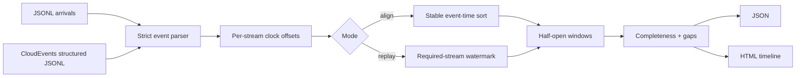

# Architecture and semantics

Stream Quilt treats alignment as an event-time problem. It never uses the machine's wall clock, so
the same inputs and configuration produce the same windows on every run.



## Event time and offsets

An event's normalized start is `timestamp_ms + offsets_ms[stream]`. Duration is not scaled. A positive
offset moves an observed clock forward. `estimate_offset()` accepts matched `(reference, observed)`
anchors and returns the median of `reference - observed`, plus residual diagnostics. It estimates only
a constant offset; it does not model clock drift.

## Window membership

Windows are `[start, end)` intervals. An instantaneous event at `end` belongs to the next window. A
duration event belongs to every window whose interval it overlaps. `hop_ms < window_ms` creates
overlap; `hop_ms > window_ms` intentionally leaves uncovered gaps. Accepted events in those gaps are
reported through `unassigned_event_ids`.

Required streams determine `complete`: a window is complete when it contains at least one event from
each required stream. Optional streams can still have offsets and cadence expectations.

## Streaming watermarks

The replay API records the greatest normalized timestamp seen for each required stream. Once all are
present:

```text
watermark = min(max_seen[required_stream]) - allowed_lateness_ms
```

A window closes when its end is at or behind that watermark. No previously returned window is ever
modified. This makes output append-only and auditable.

When `required_streams` is empty, the watermark stays undefined and replay emits only on `flush()`.
The aligner cannot know that an unseen stream will not later arrive, so inferring participants from
the first arrival could close windows prematurely. Configure one required stream explicitly for a
single-stream live replay.

An event is late when it overlaps or precedes output that has already closed. `reject` raises and
`drop` records its ID. `accept` records a partially late event and retains the portion that can still
affect open windows; it never reopens closed output. A fully obsolete event has no legal destination
and is recorded as dropped even under `accept`.

`flush()` emits the fixed window grid through the final buffered event horizon. Intermediate windows
can therefore be empty; preserving them keeps indexes and time ranges stable across runs.

Ready windows are previewed and validated as one transaction. Only after every window in the batch
passes resource checks does the aligner advance its index, prune its buffer, and return the batch.

## Offline mode

`align_events()` sorts by normalized timestamp, stream, and event ID before replaying. It is therefore
independent of input order and suitable for datasets. The CLI `replay` intentionally preserves JSONL
arrival order to exercise live watermark behavior.

## Gap diagnostics

For streams listed in `expected_cadence_ms`, consecutive normalized start times are compared. A gap is
reported only when the observed interval is strictly greater than `expected × gap_factor`. Gap start
marks one expected interval after the prior event; gap end is the next event start.
Cadence is a source-observation diagnostic, so it includes arrivals that a replay later drops as late.

## Complexity and memory

Each window scans the currently relevant buffer. For `E` events and `W` windows, the worst case is
`O(E × W)`, especially when long events overlap many windows. This simple implementation favors
clarity for offline evaluation and moderate streams. Very high-rate, long-lived services should use a
specialized interval index and explicit disk-backed retention.

## Integration and experimental boundary

The CloudEvents adapter terminates at validated `Event` objects; transport acknowledgement,
authentication, retry, and broker offsets remain the caller's responsibility. The benchmark compares
offline sorting and watermark replay on a versioned generated workload and checks their canonical
result digests. Full mapping rules and responsible reporting are documented in
[cloudevents-and-benchmarks.md](cloudevents-and-benchmarks.md).
