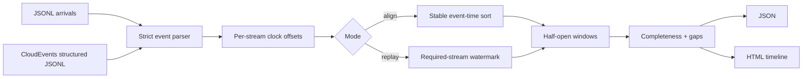

# Architecture and semantics

Stream Quilt treats alignment as an event-time problem. It never uses the machine's wall clock, so
the same inputs and configuration produce the same windows on every run.



## Event time and offsets

An event's normalized start is `timestamp_ms + offsets_ms[stream]`. Duration is not scaled. A positive
offset moves an observed clock forward. `estimate_offset()` accepts matched `(reference, observed)`
anchors and returns the median of `reference - observed`, plus residual diagnostics. It estimates only
a constant offset; it does not model clock drift.

## Window membership

Windows are `[start, end)` intervals. An instantaneous event at `end` belongs to the next window. A
duration event belongs to every window whose interval it overlaps. `hop_ms < window_ms` creates
overlap; `hop_ms > window_ms` intentionally leaves uncovered gaps. Accepted events in those gaps are
reported through `unassigned_event_ids`.

Required streams determine `complete`: a window is complete when it contains at least one event from
each required stream. Optional streams can still have offsets and cadence expectations.

## Streaming watermarks

The replay API records the greatest normalized timestamp seen for each required stream. Once all are
present:

```text
watermark = min(max_seen[required_stream]) - allowed_lateness_ms
```

A window closes when its end is at or behind that watermark. No previously returned window is ever
modified. This makes output append-only and auditable.

When `required_streams` is empty, the watermark stays undefined and replay emits only on `flush()`.
The aligner cannot know that an unseen stream will not later arrive, so inferring participants from
the first arrival could close windows prematurely. Configure one required stream explicitly for a
single-stream live replay.

An event is late when it overlaps or precedes output that has already closed. `reject` raises and
`drop` records its ID. `accept` records a partially late event and retains the portion that can still
affect open windows; it never reopens closed output. A fully obsolete event has no legal destination
and is recorded as dropped even under `accept`.

`flush()` emits the fixed window grid through the final buffered event horizon. Intermediate windows
can therefore be empty; preserving them keeps indexes and time ranges stable across runs.

Ready windows are previewed and validated as one transaction. Only after every window in the batch
passes resource checks does the aligner advance its index, prune its buffer, and return the batch.

## Offline mode

`align_events()` sorts by normalized timestamp, stream, and event ID before replaying. It is therefore
independent of input order and suitable for datasets. The CLI `replay` intentionally preserves JSONL
arrival order to exercise live watermark behavior.

## Gap diagnostics

For streams listed in `expected_cadence_ms`, consecutive normalized start times are compared. A gap is
reported only when the observed interval is strictly greater than `expected × gap_factor`. Gap start
marks one expected interval after the prior event; gap end is the next event start.
Cadence is a source-observation diagnostic, so it includes arrivals that a replay later drops as late.

## Window membership index

Windows form the regular half-open grid `[origin + i×hop, origin + i×hop + window)`, so every event
covers one *contiguous* range of window indexes. The aligner stores each buffered event once per node
of the canonical dyadic decomposition of that range: node `(level, block)` covers indexes
`[block × 2^level, (block + 1) × 2^level)`. Answering "which events overlap window `i`" reads one
node per level on the path from that leaf to the root.

Building `W` windows over a buffer of `E` events therefore costs `O(W log E)` lookups plus the events
actually returned, instead of the earlier `O(E × W)` full scan. One very long event costs
`O(log span)` to index rather than one entry per covered window, and expiry costs `O(log span)`.

Three properties of this workload pick the structure:

- Arrivals are append-mostly behind a monotonically advancing watermark, so the index must accept
  near-frontier inserts and expire from behind. A dyadic decomposition is implicit, so there is no
  tree to rebalance and no sorted array to shift.
- Window indexes are integers on a fixed grid, which is what makes a grid-aligned structure
  applicable at all; the two grid boundaries per event are found by binary search over the same
  overlap predicate the window builder uses, so no floating-point division can make the index and the
  builder disagree.
- Queries never mutate the index. A sweep-line active set would have to be rolled back whenever a
  previewed batch is rejected; a pure query needs no rollback.

Expiry is exact rather than heuristic: "horizon at or before the next open window start" and "last
covered window index below the next open window index" are the same predicate, so the index drops
precisely what the buffer scan used to drop.

## Retention

The interval index expires a buffered event as soon as no future window can contain it, so buffered
memory is bounded by the watermark. Per-event *identity* records — duplicate detection, window
assignment, and the reported ID tuples — are separate, and without a policy they grow for the life of
the aligner.

`RetentionPolicy` bounds that state:

```text
release_frontier = watermark - horizon_ms
```

An identity record is released once the event's horizon is at or behind the frontier. Records are
released in arrival order, and each one is classified before it is forgotten, so
`dropped_event_ids`, `accepted_late_event_ids`, and `unassigned_event_ids` report exactly what they
would report with every record retained. A long-lived event blocks release of the records behind it,
which is the conservative direction.

Releasing can never lose an event a future window could include. A ready batch always stops with
`next_start + window_ms > watermark`, so `next_start > watermark - window_ms`. Requiring
`horizon_ms >= window_ms` therefore puts the frontier strictly behind `next_start`, which is where
the interval index has already expired the event. A policy with a shorter horizon is refused at
construction rather than silently accepted.

`max_tracked_events` is a hard ceiling on retained records, counting IDs kept only for reporting.
Reaching it raises `ValidationError`. Bounded memory cannot hold an unbounded list of reported IDs,
so the aligner stops rather than dropping one.

The default policy retains everything, which is the right choice for finite datasets and reproduces
the historical behavior exactly. Retention is a runtime property of a live aligner rather than an
alignment semantic, so it is a `WatermarkAligner` argument and not a JSON configuration field; the
file-driven `align` and `replay` paths are already bounded by the event-file record limit.

## Integration and experimental boundary

The CloudEvents adapter terminates at validated `Event` objects; transport acknowledgement,
authentication, retry, and broker offsets remain the caller's responsibility. The benchmark compares
offline sorting and watermark replay on a versioned generated workload and checks their canonical
result digests. Full mapping rules and responsible reporting are documented in
[cloudevents-and-benchmarks.md](cloudevents-and-benchmarks.md).
